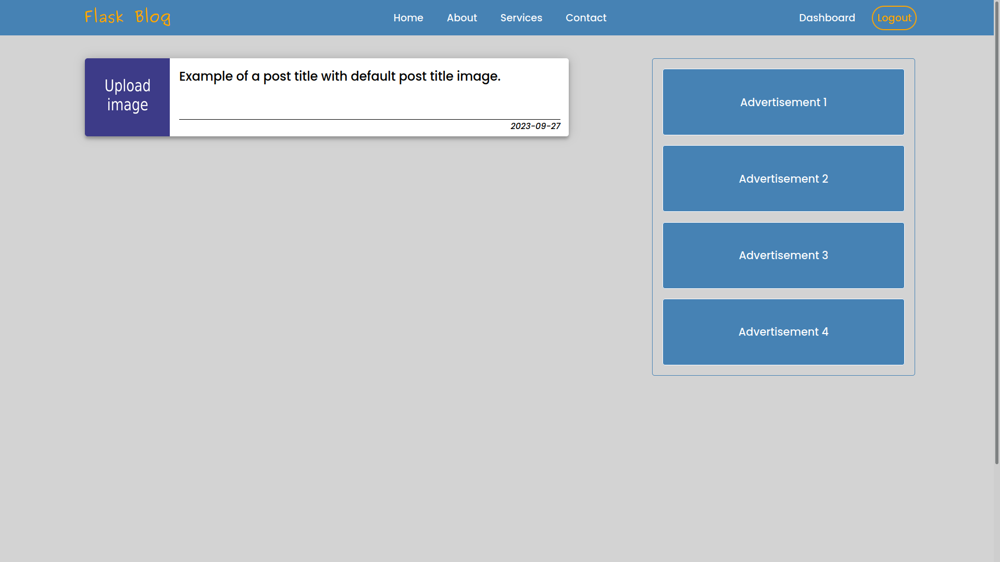
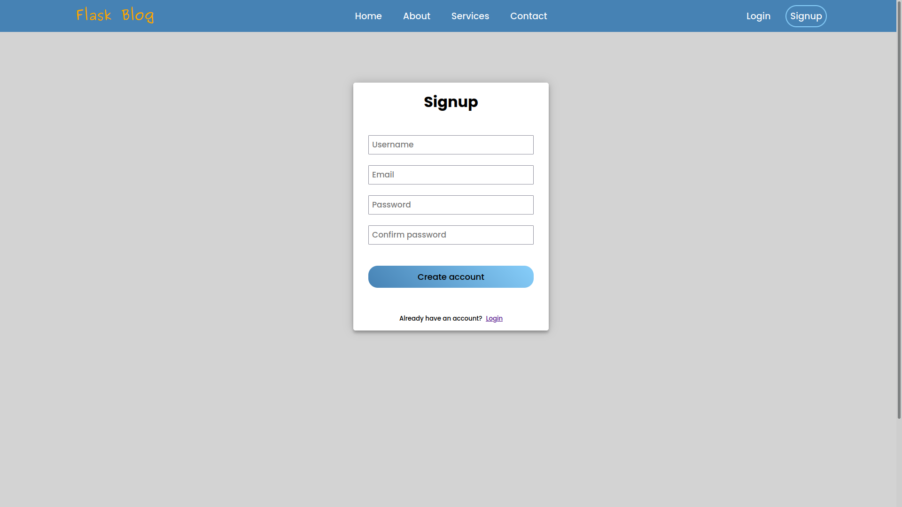
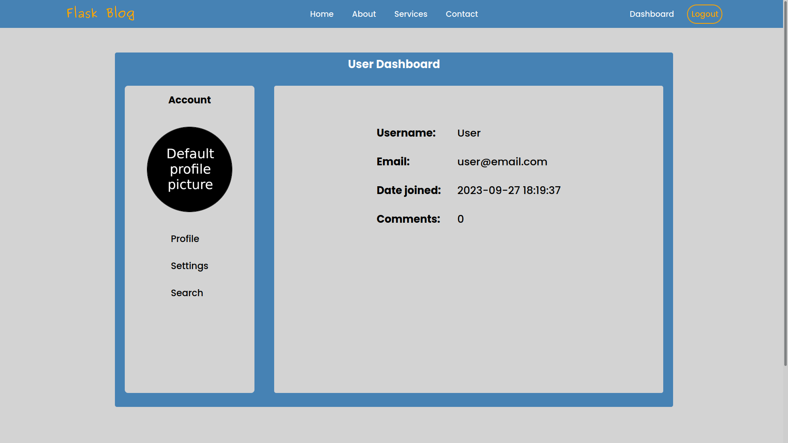
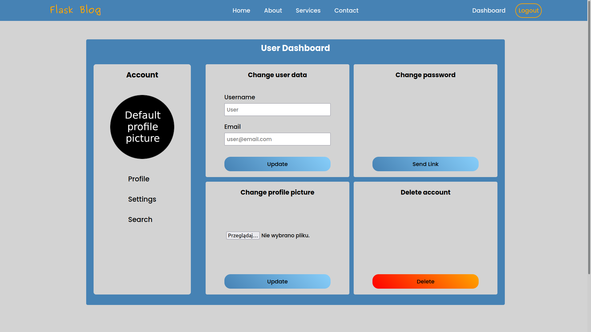
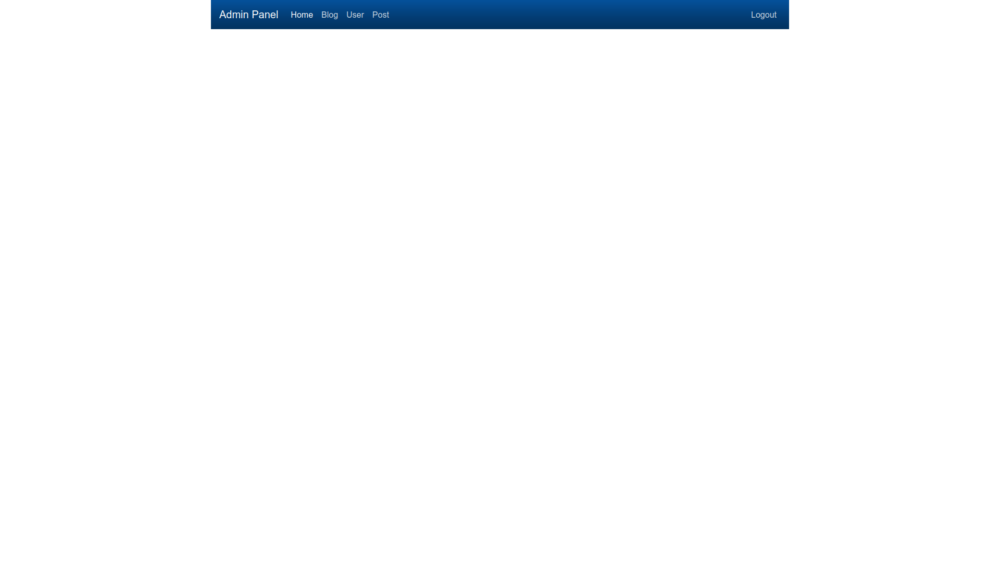
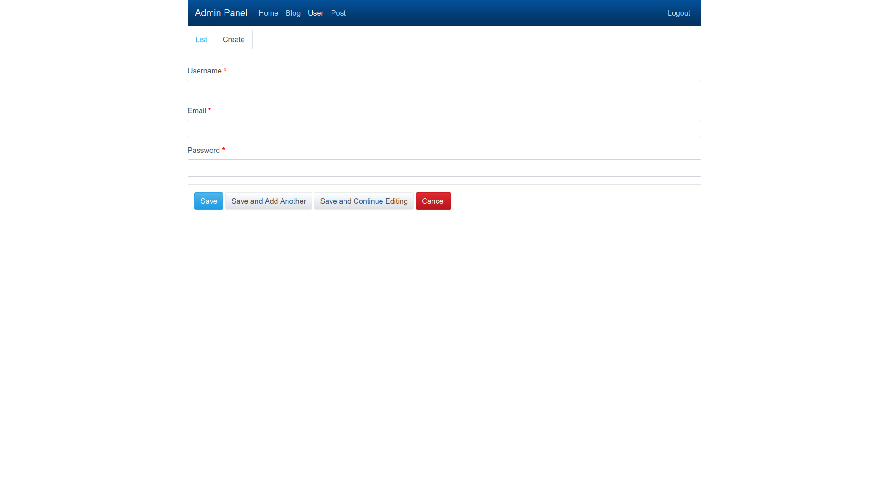

<h1 align="center">Flask Blog</h1>
<br>

This is very simple and lighweight blog where
------------

1. Blog's owner (admin) can:
    * add and delete user
    * change user data
    * create, edit and delete posts
    * edit and delete user's comment
2. User can:
    * register
    * login
    * edit it's data
    * delete it's account
    * change profile picture
    * create, edit and delete comments


Installation
------------


1. Install Python

    https://www.python.org/downloads/
    
    or
   
    ```
    sudo apt update
    sudo apt install software-properties-common
    sudo add-apt-repository ppa:deadsnakes/ppa
    sudo apt update
    sudo apt install python3.11
    ```


2. Download github repository

    ```
    git clone https://github.com/KrzysztofRozmus/flask-blog.git
    ```

3. Go to the project directory


4. Create virtual environment
    * For VENV
      - create virtual environment   
        ```
        python3 -m venv env
        ```
    
      - activate virtual environment   
        ```
        source venv/bin/activate
        ```
        or
        ```
        .\venv\Scripts\activate
        ```
    
      - install dependencied  
        ```
        pip install -r requirements.txt
        ```
    * For PIPENV
      
      - create virtual environment and install dependecies
        ```
        pipenv install --ignore-pipfile
        ```
      - activate virtual environment
        ```
        pipenv shell
        ```


5. Run flask local server

   ```
   python3.11 run.py
   ```


6. Paste displayed URL address `http://127.0.0.1:5000/` to your browser


7. Create Admin account

   ```
   http://127.0.0.1:5000/create_admin
   ```
   
   
8. Login as Admin

   * Login:    admin@example.com
   * Pasword:  admin


Screenshots
------------
1. Home

 

2. Signup

 

3. User Dashboard

 

4. User Settings

 

5. Admin Panel

 

6. Create User in Admin Panel

 
